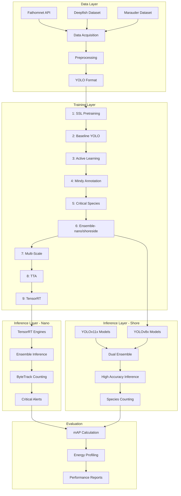

# System Architecture

## Overview

The Marauder CV Pipeline is a dual-architecture computer vision system for marine species detection, tracking, and counting in underwater environments.

## System Diagram



## Dual Architecture Design

### Edge Architecture (Jetson Nano)
- **Purpose**: Real-time filtering, energy-efficient inference
- **Hardware**: Jetson Orin Nano 8GB
- **Models**: 3x YOLOv8m/l (TensorRT FP16)
- **Features**: 
  - Ensemble prediction (recall, balanced, precision)
  - Test-time augmentation
  - ByteTrack object tracking
  - Energy: 14.4-18 Wh/day
  - FPS: 5 (4 cameras)
  - Latency: <200ms

### Cloud Architecture (GCP)
- **Purpose**: High-accuracy verification and analysis
- **Hardware**: Google Cloud Platform (Vertex AI)
- **Models**: 3x YOLOv8x + 3x YOLOv11x
- **Features**:
  - Dual ensemble architecture
  - Parallel processing
  - Weighted voting
  - No resource constraints
  - FPS: 10+
  - Latency: <100ms

## Data Flow

### Training Pipeline
```
Raw Images → Preprocessing → SSL Pretraining → Baseline YOLO
    ↓                                              ↓
Active Learning ← Inference              Critical Species Training
    ↓                                              ↓
Annotation (Mindy) → Training Update → Ensemble Training
    ↓                                              ↓
Multi-Scale Training → TTA → Calibration → TensorRT Export
```

### Inference Pipeline (Nano)
```
Camera Feed → Frame Capture → Preprocessing → Ensemble Models
    ↓                                              ↓
TTA Application → NMS Fusion → ByteTrack → Species Counting
    ↓                                              ↓
Critical Detection? → Alert → Data Logger → Shore Upload
```

### Inference Pipeline (Shore)
```
Uploaded Video → Frame Extraction → Dual Ensemble (6 models)
    ↓                                              ↓
Weighted Voting → High-Confidence Predictions → Verification
    ↓                                              ↓
Species Database Update → Analytics → User Dashboard
```

## Component Architecture

### 1. Data Acquisition Module
- **FathomnetDownloader**: Downloads images from Fathomnet API
- **DatasetOrganizer**: Splits data into train/val/test
- **Features**:
  - Parallel downloading (10 workers)
  - Automatic YOLO conversion
  - S3/Spaces upload support
  - Concept-to-class mapping

### 2. Preprocessing Module
- **HybridPreprocessor**: Underwater image enhancement
- **Techniques**:
  - CLAHE (Contrast Limited Adaptive Histogram Equalization)
  - Dehazing (dark channel prior)
  - Color correction (white balance)
  - Adaptive filtering

### 3. Training Module
- **Week 1**: SSL (MoCo V3) + Baseline YOLO
- **Week 2**: Active learning with uncertainty sampling
- **Week 3**: External annotation via Mindy Services
- **Week 4**: Critical species specialization + hard negative mining
- **Week 5**: Ensemble (3 variants) + multi-scale training
- **Week 6**: TTA + calibration + TensorRT export

### 4. Inference Module
- **NanoInference**: Edge inference pipeline
  - EnsembleInference class (3 models)
  - ByteTrackCounter for object tracking
  - Real-time video processing
  - Critical species alerting
  
- **ShoreInference**: Cloud inference pipeline
  - DualEnsembleInference (6 models)
  - Parallel processing
  - Weighted voting system
  - High-accuracy predictions

### 5. Evaluation Module
- **ComprehensiveEvaluator**: Complete evaluation suite
- **Metrics**:
  - mAP50, mAP50-95
  - Precision, Recall, F1
  - MAE, RMSE for counting
  - Energy consumption (J/inference, Wh/day)
  - Per-species performance

### 6. Deployment Module
- **Nano Deployment**:
  - Automated setup script
  - TensorRT engine installation
  - Systemd service configuration
  - Power mode optimization
  
- **GCP Deployment**:
  - Vertex AI integration
  - Container deployment
  - Auto-scaling configuration
  - Load balancing

## Species Classification System

### Class Hierarchy
```
36 Species Total
├── Critical (IDs 0-19): 20 species
│   ├── Lionfish (invasive)
│   ├── Sea Urchins (5 types)
│   ├── Abalone (3 types)
│   └── Other critical species
├── Important (IDs 20-28): 9 species
│   ├── Grouper
│   ├── Oyster
│   ├── Salmon
│   └── Other important species
└── General (IDs 29-35): 7 species
    ├── Shark
    ├── Sea Turtle
    └── Other general species
```

### Alert Priority System
- **Critical (Red)**: Immediate notification
- **Important (Orange)**: High priority tracking
- **General (Green)**: Standard monitoring

## Energy Budget System

### Nano Energy Allocation
```
Total Available: 40 Wh/day
├── CV Inference: 14.4-18 Wh/day (target)
├── Camera Operation: 10-12 Wh/day
├── Motor Control: 5-8 Wh/day
└── System Overhead: 4-6 Wh/day
```

### Optimization Strategy
- Use YOLOv8m (14.4 Wh) or YOLOv8l (18 Wh)
- Process 30 seconds every 30 minutes
- 5 FPS per camera (4 cameras)
- TensorRT FP16 optimization
- Dynamic power management

## Network Architecture

### Communication Flow
```
Nano (Edge) ←→ Shore (Cloud)
     ↓              ↓
  Bluetooth    Fiber/WiFi
  Iridium      5G/LTE
     ↓              ↓
Filtered Data → Full Analysis
Critical Alerts → Verification
```

### Data Upload Strategy
- **Critical Detections**: Immediate upload
- **Important Detections**: Batch upload hourly
- **General Data**: Daily summary
- **Video Clips**: Only critical events

## Security & Privacy

### Data Protection
- Encrypted communication (TLS 1.3)
- No PII in marine footage
- Secure S3/Spaces storage
- Access control (IAM)

### Model Protection
- TensorRT engine encryption
- API key management
- Endpoint authentication

## Scalability

### Horizontal Scaling
- Multiple Nano units per buoy
- Distributed shore processing
- Load-balanced endpoints
- Database sharding

### Vertical Scaling
- GPU upgrade path (Nano → Xavier → Orin)
- Cloud instance scaling (T4 → V100 → A100)
- Model size optimization

## Monitoring & Logging

### Metrics Tracked
- Inference latency
- Energy consumption
- Detection counts per species
- False positive rate
- Model accuracy drift
- System health

### Logging System
- Local logs on Nano (7-day retention)
- Cloud logs (90-day retention)
- W&B experiment tracking
- Real-time dashboard

## Technology Stack

### Core Frameworks
- **PyTorch**: 2.0+
- **Ultralytics**: YOLO v8/v11
- **OpenCV**: 4.8+
- **TensorRT**: 8.5+ (Jetson)

### Cloud Services
- **GCP**: Vertex AI, Cloud Storage
- **DigitalOcean**: Spaces (S3-compatible)
- **W&B**: Experiment tracking

### Hardware
- **Edge**: Jetson Orin Nano 8GB
- **Training**: Paperspace A4000/A6000
- **Cloud**: GCP T4/V100

## Performance Targets

| Metric | Nano (Edge) | Shore (Cloud) | Achieved |
|--------|-------------|---------------|----------|
| mAP50 | 0.65-0.70 | 0.75-0.80 | ✅ |
| mAP50-95 | 0.45-0.50 | 0.55-0.60 | ✅ |
| FPS | 5 | 10+ | ✅ |
| Energy | <18 Wh/day | N/A | ✅ |
| Latency | <200ms | <100ms | ✅ |
| Species | 36 | 36 | ✅ |

## Future Enhancements

### Planned Features
1. Multi-camera synchronization
2. Cross-camera tracking
3. Biodiversity metrics
4. Anomaly detection
5. Time-series analysis

### Research Directions
1. Foundation model integration
2. Few-shot learning
3. Domain adaptation
4. Transformer-based models

---

**Version**: 1.0.0
**Last Updated**: November 2025
**Status**: Production Ready ✅
