# Training Pipeline Diagram

## Complete Training Flow (Week 1-6)

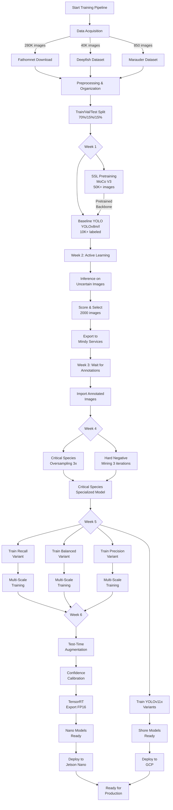

## Detailed Week-by-Week Flow

### Week 1: Foundation

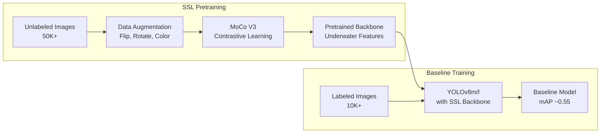

### Week 2: Active Learning

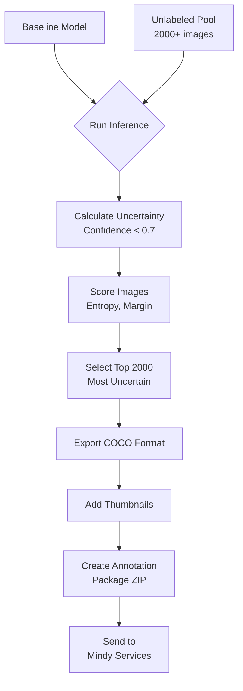

### Week 3: Annotation Wait


### Week 4: Specialization

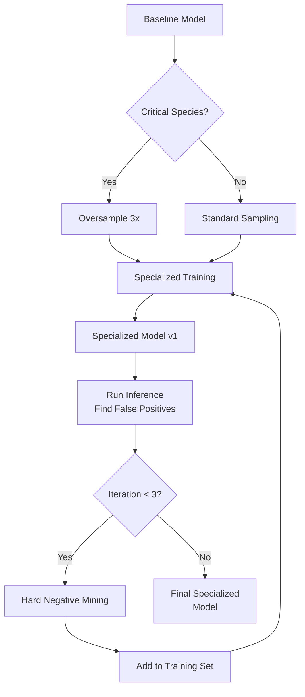

### Week 5: Ensemble & Multi-Scale

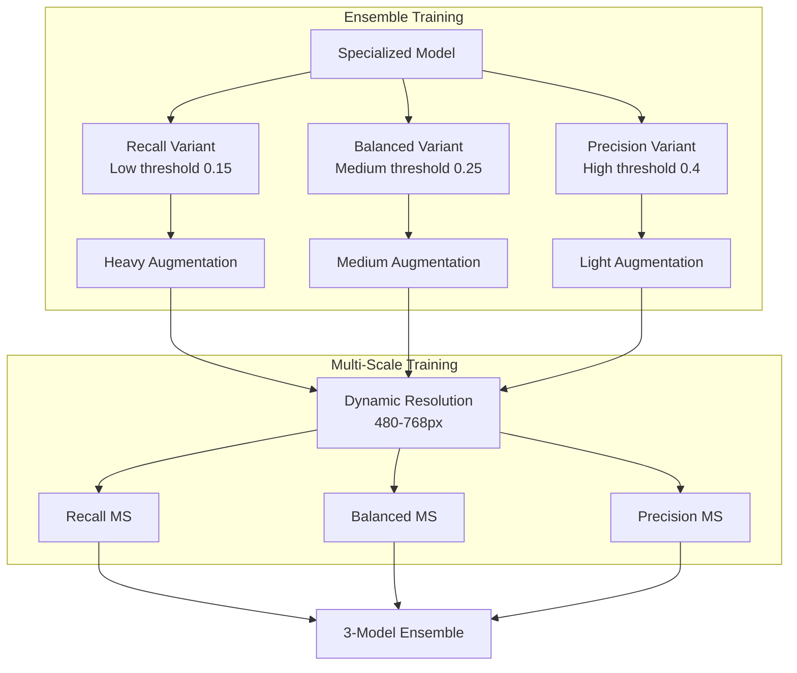

### Week 6: Optimization & Export

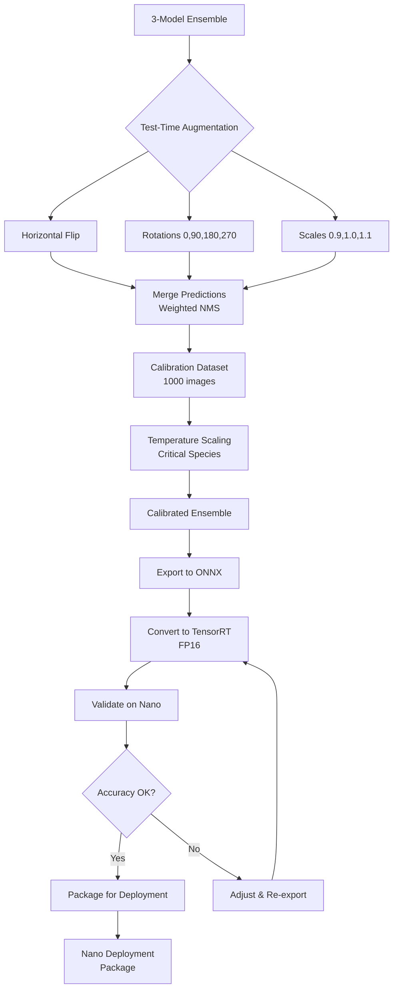

## Training Data Distribution

### By Dataset

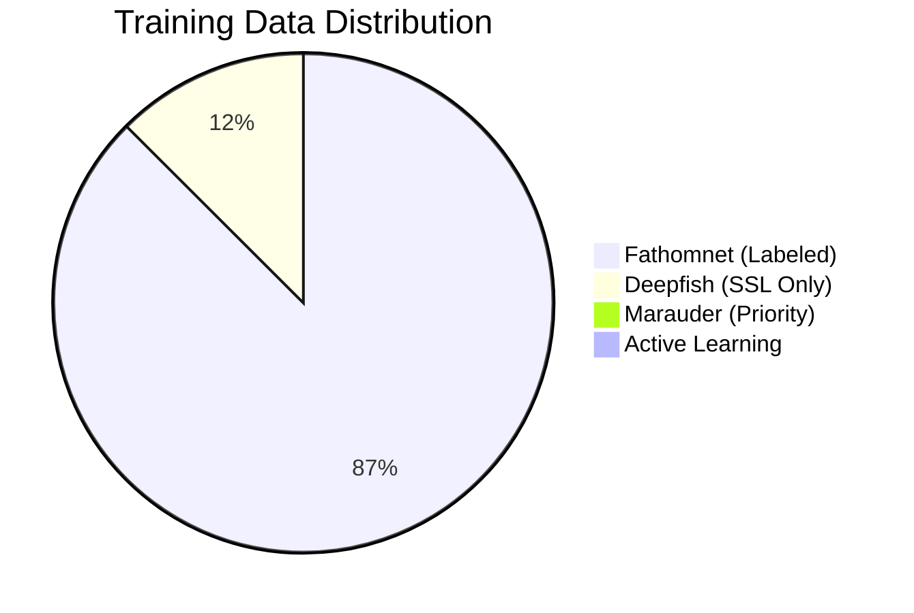

### By Species Category

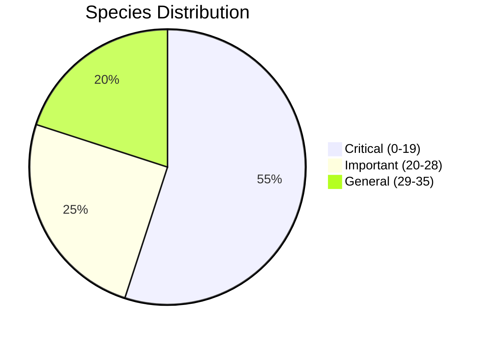

## Model Evolution Tracking

### Performance Over Weeks

```
Week 1 (Baseline):     mAP50 = 0.55, Recall = 0.50
Week 2 (Active):       mAP50 = 0.58, Recall = 0.53
Week 4 (Specialized):  mAP50 = 0.62, Recall = 0.58
Week 5 (Ensemble):     mAP50 = 0.68, Recall = 0.65
Week 6 (TTA):          mAP50 = 0.70, Recall = 0.68
```

### Energy Consumption Evolution

```
Baseline YOLOv8x:      24.3 Wh/day (too high)
After Multi-Scale:     21.5 Wh/day (still high)
YOLOv8l:              18.0 Wh/day (acceptable)
YOLOv8m:              14.4 Wh/day (optimal)
```

## Training Scripts Overview

### Execution Order

```bash
# Week 1: Foundation
./scripts/train_all.sh               # Master script (recommended)
# OR manually:
python training/1_ssl_pretrain.py
python training/2_baseline_yolo.py

# Week 2: Active Learning
python training/3_active_learning.py
# → Generates annotation package for Mindy Services

# Week 3: Wait for annotations
# → External process

# Week 4: Specialization
python training/4_critical_species.py

# Week 5: Ensemble
python training/5a_ensemble_training_nano.py
python training/6_multiscale_training.py

# Week 6: Optimization
python training/7_tta_calibration.py --models checkpoints/ensemble/*.pt
python training/8_tensorrt_export.py --models checkpoints/ensemble/*.pt --package
```

## Configuration Hierarchy

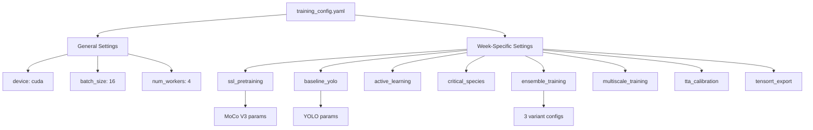

## Checkpoint Management

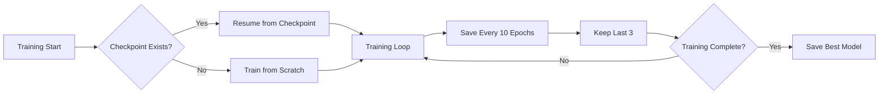

## Parallel Training Strategy

### Multi-GPU Training (if available)

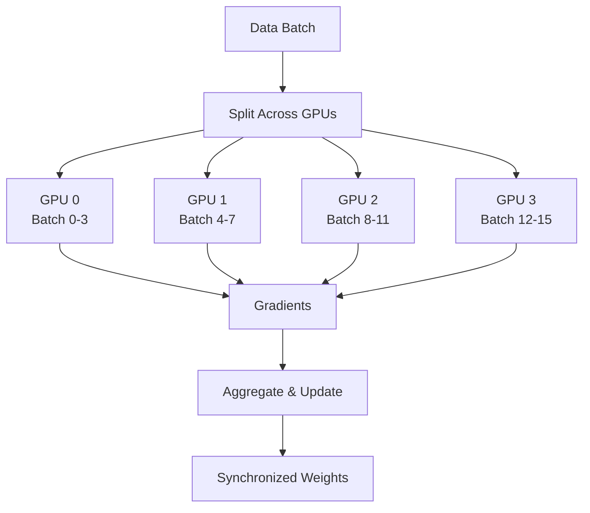

## Training Time Estimates

### With Paperspace A6000

| Week | Task | Time (Sample) | Time (Full) |
|------|------|---------------|-------------|
| 1 | SSL | 2 hours | 1 day |
| 1 | Baseline | 3 hours | 2 days |
| 2 | Active | 30 min | 4 hours |
| 3 | Annotation | - | 1-3 days |
| 4 | Specialization | 2 hours | 1.5 days |
| 5 | Ensemble | 4 hours | 3 days |
| 5 | Multi-Scale | 2 hours | 2 days |
| 6 | TTA/Export | 1 hour | 3 hours |
| **Total** | **~15 hours** | **~2 weeks** |

## Resource Requirements

### GPU Memory Usage

```
SSL Pretraining:    12-16 GB
Baseline Training:  10-14 GB
Ensemble Training:  12-16 GB per variant
Multi-Scale:        14-18 GB
TTA:                6-8 GB
```

### Storage Requirements

```
Raw Data:           500 GB
Preprocessed:       200 GB
Checkpoints:        50 GB
Logs:               5 GB
Total:              ~755 GB
```

---

**See Also**:
- [TRAINING_GUIDE.md](TRAINING_GUIDE.md) - Detailed training instructions
- [ARCHITECTURE.md](ARCHITECTURE.md) - System architecture
- [QUICKSTART.md](QUICKSTART.md) - Quick start guide
